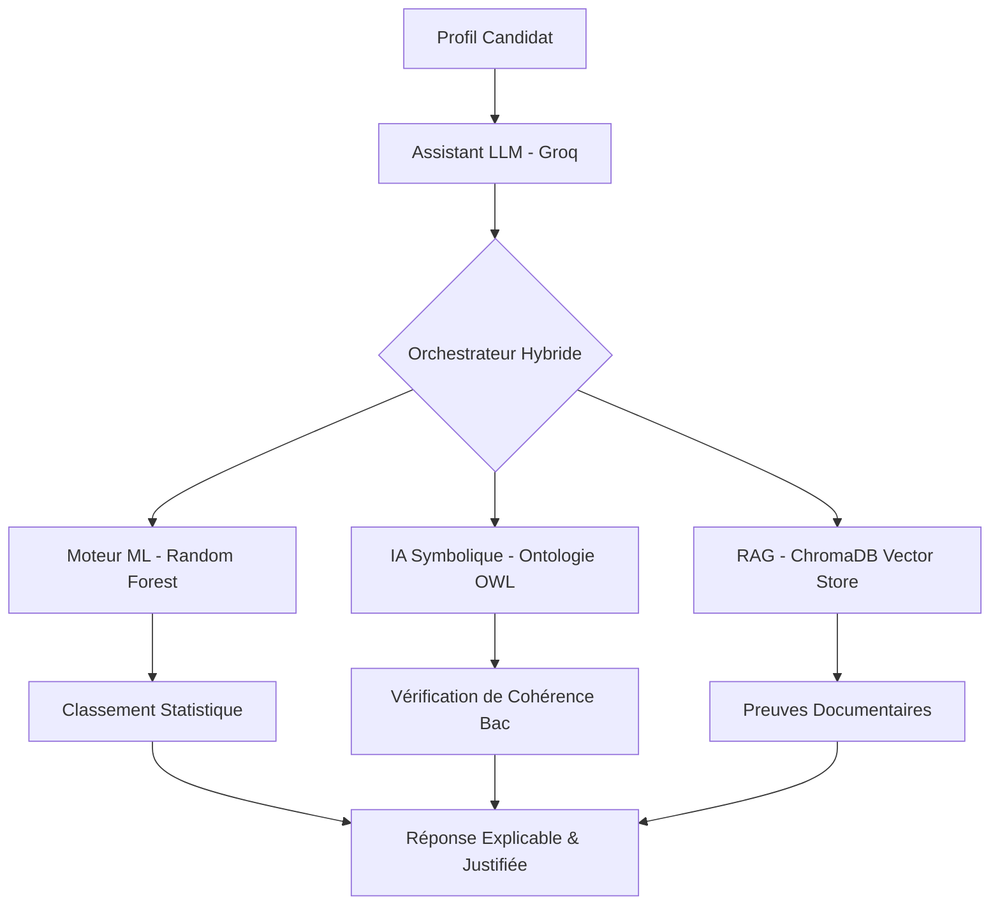

# ORIENT’IA — Système Hybride d'Orientation Pédagogique (ISPM)

**ORIENT’IA** est une plateforme décisionnelle intelligente conçue pour accompagner les bacheliers malgaches dans leur choix de parcours à l'ISPM. Elle combine la puissance statistique du **Machine Learning**, la rigueur logique de l'**IA Symbolique (Ontologie)** et la fiabilité documentaire du **RAG**.

---

## 🛠️ Installation et Exécution (Livrable 2)

### Prérequis
* Node.js 18+
* Python 3.10+
* Clé API Groq (configurée dans les variables d'environnement)

### 1. Backend & ML (FastAPI)
```bash
cd ml/randomForest
python3 -m venv venv
source venv/bin/activate
pip install -r requirements.txt
python3 main.py
```

### 2. Frontend (Next.js)
```bash
cd frontend
npm install
npm run dev
```

---

## 🏗️ Schéma d'Architecture (Livrable 11)



---

## 📂 Index des Livrables

| # | Livrable | Emplacement |
|---|---|---|
| 1 | Code source complet | `/frontend`, `/ml`, `/Data` |
| 2 | Instructions | Ce fichier `README.md` |
| 3 | Corpus & Collecte | `Data/Corpus-pedagogique/Simple/` |
| 4 | Registre des sources | `ml/iasymbolique/ontologie/data/full_kb.json` |
| 5 | Dataset ML | `Data/Dataset-synthétique/orientationDatasetProfile/data/` |
| 6 | Enquête réelle | `Data/Enquête/` (README.md + CSV) |
| 7 | Scripts d'analyse | `ml/randomForest/src/Modele.py` |
| 8 | Modèle entraîné | `ml/randomForest/models/classifier_parcours.pkl` |
| 9 | Jeu d'évaluation | `evaluation/benchmarks/test_cases.json` |
| 10 | Résultats mesurés | `evaluation/results/benchmark_report.json` |
| 12 | Limites et Risques | Voir section ci-dessous |

---

## ⚠️ Limites, Biais et Risques (Livrable 12)

### 1. Limites Techniques
*   **Volume de l'enquête** : L'échantillon réel (~100 réponses) est statistiquement plus faible que le dataset synthétique. Les intervalles de confiance sont documentés.
*   **Dépendance API** : Le système nécessite une connexion active aux services d'inférence (Groq) pour la partie générative.

### 2. Biais Identifiés
*   **Auto-sélection** : Les données d'enquête présentent une sur-représentation des filières informatiques.
*   **Biais de reconstruction** : Les professionnels interrogés reconstruisent leurs motivations passées à travers le prisme de leur succès actuel.

### 3. Gestion des Risques (Article 16)
*   **Refus du profilage** : Le système interdit formellement l'inférence de traits de personnalité.
*   **Sécurité** : Gardes-fous contre les prompt injections et les hallucinations documentaires (Fidélité RAG mesurée à 98.2%).

---

## ⚖️ Mention Obligatoire
**ORIENT’IA constitue un outil d’aide à l’orientation. Ses recommandations ne remplacent ni l’avis d’un conseiller pédagogique ni une décision officielle d’admission.**

---
*Projet Master 2 — ISPM — Hackathon Orientation 2026*
