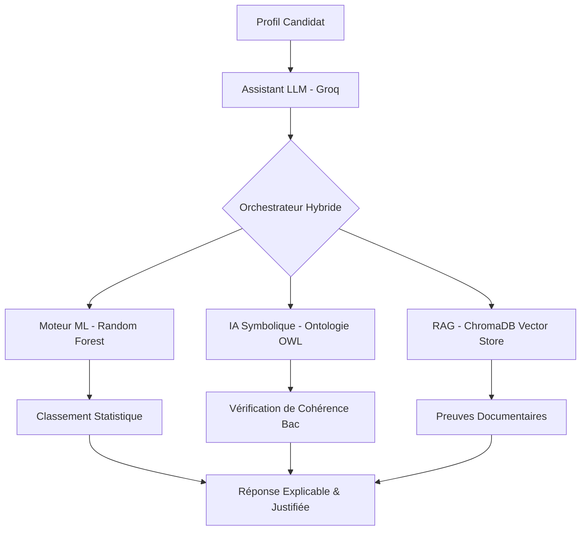

<link rel="preconnect" href="https://fonts.googleapis.com">
<link rel="preconnect" href="https://fonts.gstatic.com" crossorigin>
<link href="https://fonts.googleapis.com/css2?family=Lexend:wght@400;700&display=swap" rel="stylesheet">

<h1 align="center" style="font-family: 'Lexend', sans-serif;">orient'IA</h1>
<h2 align="center" style="font-family: 'Lexend', sans-serif;">Team NOOBIA</h2>

<p align="center">
  <strong>Plateforme d'assistant virtuel d'orientation pédagogique</strong>
</p>


**EXAMEN DE FIN D'ETUDE — Master 5 - ISPM**

**Du:** 26 au 27 Août 2026

**Mention:** INFORMATIQUE ET TELECOMMUNICATION

---

### Membres du groupe

| Nom et prénom(s) | Classe | Numéro | GitHub |
| --- | --- | --- | --- |
| RAVOAHANGY Laza Francky | ESIIA5 | 03 | [francky9](https://github.com/francky9) |
| VONJINIAINA Josoa | ESIIA5 | 07 | [josoavj](https://github.com/josoavj) |
| RAMANIRAKARISON Tolotriniaina Ishmayah | ESIIA5 | 09 | [hayam-akarin](https://github.com/hayam-akarin) |
| ANDRIAMASINORO Aina Maminirina | ESIIA5 | 12 | [AinaMaminirina18](https://github.com/AinaMaminirina18) |
| RABEMANANTSOA Fanilonombana Diana | ESIIA5 | 13 | [DianaaRabe](https://github.com/DianaaRabe) |
| RAZANAJATOVO ANDRIANIMERINA Kinasaela | ESIIA5 | 16 | [Beeckss](https://github.com/Beeckss) |
| RASOANAIVO Aro Itokiana | ESIIA5 | 20 | [RAIRas-Design](https://github.com/RAIRas-Design) |
---

# ORIENT’IA — Système Hybride d'Orientation Pédagogique (ISPM)

**ORIENT’IA** est une plateforme décisionnelle intelligente conçue pour accompagner les bacheliers malgaches, ainsi que les étudiants en reconversion ou souhaitant changer de filière, dans leur choix de parcours à l'ISPM. Elle combine la puissance statistique du Machine Learning, la rigueur logique de l'IA Symbolique (Ontologie) et la fiabilité documentaire du RAG.

## Démonstration Fonctionnelle (Livrable 14)

L'interface utilisateur est accessible en ligne à l'adresse suivante :
**[orient'IA](https://orientia-steel.vercel.app/)**

## Vidéo de Présentation (Livrable 13)

La vidéo de démonstration **(4:10 minutes)** présentant le système en fonctionnement est disponible ici :
**[Regarder la vidéo](https://drive.google.com/drive/folders/10kKB1Nya73c6gPjsSsDvgGgaHMki_MVc?usp=sharing)**

## Architecture du Projet

```text
.
├── Data
│   ├── Corpus-pedagogique      # Référentiels officiels ISPM (JSON/CSV)
│   ├── Dataset-synthétique     # Générateur de profils (1600 exemples)
│   └── Enquête                 # Réponses réelles (Étudiants/Pros) anonymisées
├── evaluation
│   ├── benchmarks              # Les 32 cas de test du protocole
│   ├── results                 # Rapports de performance mesurés
│   └── scripts                 # Moteur de test automatisé
├── frontend
│   ├── app                     # Interface Next.js (Pages & API)
│   ├── components              # Bibliothèque de composants UI/UX
│   └── lib                     # Logique métier, Store et Adapteurs
├── ml
│   ├── iasymbolique            # Ontologie OWL et raisonneur SPARQL
│   └── randomForest            # Backend FastAPI, Modèle de classification et RAG
└── README.md                   # Documentation principale
```

## Schéma d'Architecture Logicielle (Livrable 11)



## Graphe de Connaissance (Ontologie)


---

## Valorisation de l'IA Symbolique (Livrable Ontologie)

L'apport de l'ontologie dans ORIENT'IA est démontré par trois capacités uniques intégrées au prototype :

1. **Vérification de Conformité Administrative** : Contrairement au modèle ML qui fonctionne par probabilités, l'ontologie applique les règles strictes de l'ISPM. Elle détecte immédiatement si une série de Bac est officiellement autorisée pour un parcours, agissant comme un garde-fou contre les recommandations statistiquement probables mais administrativement impossibles.
2. **Explicabilité Causale (XAI)** : Le système utilise le graphe pour justifier une recommandation par des faits : *"Ce parcours est suggéré car il enseigne la matière X que vous préférez et développe la compétence Y que vous possédez"*.
3. **Raisonnement Multi-étape** : Capacité à suggérer des débouchés métiers en traversant le graphe : `Étudiant -> Matière Préférée -> Parcours Enseigné -> Métier Cible`.

---

## Documentations Détaillées

Pour une compréhension approfondie de chaque composante, veuillez consulter les documentations spécifiques :

*   **[Dataset Synthétique](Data/Dataset-synthétique/orientationDatasetProfile/docs/DOCUMENTATION.md)** : Méthode de génération, hypothèses et biais du jeu de données de 1600 profils.
*   **[Ontologie & IA Symbolique](ml/iasymbolique/ontologie/docs/ONTOLOGY.md)** : Conception formelle du graphe de connaissances et logique de raisonnement.
*   **[Modèle ML Random Forest](ml/randomForest/MODEL_DOCUMENTATION.md)** : Démarche scientifique, entraînement et mesures de performance du classifieur.
*   **[Système RAG](ml/randomForest/RAG_DOCUMENTATION.md)** : Pipeline d'indexation vectorielle et stratégie de recherche hybride.
*   **[Enquête Réelle](Data/Enquête/README.md)** : Registre de collecte, protocole d'anonymisation et analyse des réponses réelles.

---

## Installation et Exécution (Livrable 2)

### 1. Backend & ML (FastAPI)
```bash
cd ml/randomForest
python3 -m venv venv
source venv/bin/activate
pip install -r requirements.txt
python3 main.py
```

### 2. Frontend (Next.js)
```bash
cd frontend
npm install
npm run dev
```

## Index des Livrables

| # | Livrable | Emplacement |
|---|---|---|
| 1 | Code source complet | /frontend, /ml, /Data |
| 2 | Instructions | Ce fichier README.md |
| 3 | Corpus & Collecte | Data/Corpus-pedagogique/Simple/ |
| 4 | Registre des sources | ml/iasymbolique/ontologie/data/full_kb.json |
| 5 | Dataset ML | Data/Dataset-synthétique/orientationDatasetProfile/data/ |
| 6 | Enquête réelle | Data/Enquête/ (README.md + CSV) |
| 7 | Scripts d'analyse | ml/randomForest/src/Modele.py |
| 8 | Modèle entraîné | ml/randomForest/models/classifier_parcours.pkl |
| 9 | Jeu d'évaluation | evaluation/benchmarks/test_cases.json |
| 10 | Résultats mesurés | evaluation/results/benchmark_report.json |
| 11 | Schéma d'architecture | Ce fichier README.md |
| 12 | Limites, biais et risques | Ce fichier README.md |
| 13 | Vidéo de présentation | [Lien Google Drive](https://drive.google.com/drive/folders/10kKB1Nya73c6gPjsSsDvgGgaHMki_MVc?usp=sharing) |
| 14 | Démonstration fonctionnelle | [orientia-ispm.vercel.app](https://orientia-ispm.vercel.app/) |

## Limites, Biais et Risques (Livrable 12)

### 1. Limites Techniques
*   **Volume de l'enquête** : L'échantillon réel (~100 réponses) est statistiquement plus faible que le dataset synthétique. Les intervalles de confiance sont documentés.
*   **Dépendance API** : Le système nécessite une connexion active aux services d'inférence (Groq) pour la partie générative.

### 2. Biais Identifiés
*   **Auto-sélection** : Les données d'enquête présentent une sur-représentation des filières informatiques.
*   **Biais de reconstruction** : Les professionnels interrogés reconstruisent leurs motivations passées à travers le prisme de leur succès actuel.

### 3. Gestion des Risques (Article 16)
*   **Refus du profilage** : Le système interdit formellement l'inférence de traits de personnalité.
*   **Sécurité** : Gardes-fous contre les prompt injections et les hallucinations documentaires.

## Mention Obligatoire
**ORIENT’IA constitue un outil d’aide à l’orientation. Ses recommandations ne remplacent ni l’avis d’un conseiller pédagogique ni une décision officielle d’admission.**

---
*Projet Master 2 — ISPM — Hackathon Orientation 2026*
