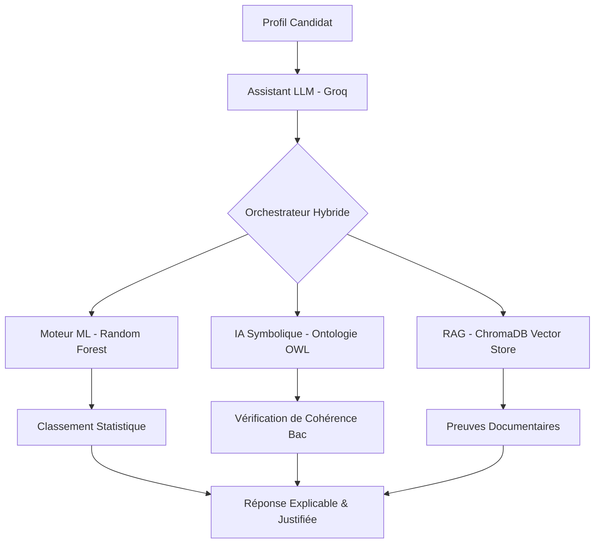

<link rel="preconnect" href="https://fonts.googleapis.com">
<link rel="preconnect" href="https://fonts.gstatic.com" crossorigin>
<link href="https://fonts.googleapis.com/css2?family=Lexend:wght@400;700&display=swap" rel="stylesheet">

<h1 align="center" style="font-family: 'Lexend', sans-serif;">orient'IA</h1>
<h2 align="center" style="font-family: 'Lexend', sans-serif;">Team NOOBIA</h2>

<p align="center">
  <strong>Plateforme d'assistant virtuel d'orientation pédagogique</strong>
</p>


**EXAMEN DE FIN D'ETUDE — Master 5 - ISPM**

**Du:** 26 au 27 Août 2026

**Mention:** INFORMATIQUE ET TELECOMMUNICATION

---

### Membres du groupe

| Nom et prénom(s) | Classe | Numéro | GitHub |
| --- | --- | --- | --- |
| RAVOAHANGY Laza Francky | ESIIA5 | 03 | [francky9](https://github.com/francky9) |
| VONJINIAINA Josoa | ESIIA5 | 07 | [josoavj](https://github.com/josoavj) |
| RAMANIRAKARISON Tolotriniaina Ishmayah | ESIIA5 | 09 | [hayam-akarin](https://github.com/hayam-akarin) |
| ANDRIAMASINORO Aina Maminirina | ESIIA5 | 12 | [AinaMaminirina18](https://github.com/AinaMaminirina18) |
| RABEMANANTSOA Fanilonombana Diana | ESIIA5 | 13 | [DianaaRabe](https://github.com/DianaaRabe) |
| RAZANAJATOVO ANDRIANIMERINA Kinasaela | ESIIA5 | 16 | [Beeckss](https://github.com/Beeckss) |
| RASOANAIVO Aro Itokiana | ESIIA5 | 20 | [RAIRas-Design](https://github.com/RAIRas-Design) |
---

# ORIENT’IA — Système Hybride d'Orientation Pédagogique (ISPM)

**ORIENT’IA** est une plateforme décisionnelle intelligente conçue pour accompagner les bacheliers malgaches dans leur choix de parcours à l'ISPM. Elle combine la puissance statistique du Machine Learning, la rigueur logique de l'IA Symbolique (Ontologie) et la fiabilité documentaire du RAG.

## Architecture du Projet

```text
.
├── Data
│   ├── Corpus-pedagogique      # Référentiels officiels ISPM (JSON/CSV)
│   ├── Dataset-synthétique     # Générateur de profils (1600 exemples)
│   └── Enquête                 # Réponses réelles (Étudiants/Pros) anonymisées
├── evaluation
│   ├── benchmarks              # Les 32 cas de test du protocole
│   ├── results                 # Rapports de performance mesurés
│   └── scripts                 # Moteur de test automatisé
├── frontend
│   ├── app                     # Interface Next.js (Pages & API)
│   ├── components              # Bibliothèque de composants UI/UX
│   └── lib                     # Logique métier, Store et Adapteurs
├── ml
│   ├── iasymbolique            # Ontologie OWL et raisonneur SPARQL
│   └── randomForest            # Backend FastAPI, Modèle de classification et RAG
└── README.md                   # Documentation principale
```

## Schéma d'Architecture Logicielle (Livrable 11)



## Installation et Exécution (Livrable 2)

### 1. Backend & ML (FastAPI)
```bash
cd ml/randomForest
python3 -m venv venv
source venv/bin/activate
pip install -r requirements.txt
python3 main.py
```

### 2. Frontend (Next.js)
```bash
cd frontend
npm install
npm run dev
```

## Index des Livrables

| # | Livrable | Emplacement |
|---|---|---|
| 1 | Code source complet | /frontend, /ml, /Data |
| 2 | Instructions | Ce fichier README.md |
| 3 | Corpus & Collecte | Data/Corpus-pedagogique/Simple/ |
| 4 | Registre des sources | ml/iasymbolique/ontologie/data/full_kb.json |
| 5 | Dataset ML | Data/Dataset-synthétique/orientationDatasetProfile/data/ |
| 6 | Enquête réelle | Data/Enquête/ (README.md + CSV) |
| 7 | Scripts d'analyse | ml/randomForest/src/Modele.py |
| 8 | Modèle entraîné | ml/randomForest/models/classifier_parcours.pkl |
| 9 | Jeu d'évaluation | evaluation/benchmarks/test_cases.json |
| 10 | Résultats mesurés | evaluation/results/benchmark_report.json |
| 12 | Limites et Risques | Voir section ci-dessous |

## Limites, Biais et Risques (Livrable 12)

### 1. Limites Techniques
*   **Volume de l'enquête** : L'échantillon réel (~100 réponses) est statistiquement plus faible que le dataset synthétique.
*   **Dépendance API** : Le système nécessite une connexion active aux services d'inférence (Groq) pour la partie générative.

### 2. Biais Identifiés
*   **Auto-sélection** : Les données d'enquête présentent une sur-représentation des filières informatiques.
*   **Biais de reconstruction** : Les professionnels interrogés reconstruisent leurs motivations passées à travers le prisme de leur succès actuel.

### 3. Gestion des Risques (Article 16)
*   **Refus du profilage** : Le système interdit formellement l'inférence de traits de personnalité.
*   **Sécurité** : Gardes-fous contre les prompt injections et les hallucinations documentaires.

## Mention Obligatoire
**ORIENT’IA constitue un outil d’aide à l’orientation. Ses recommandations ne remplacent ni l’avis d’un conseiller pédagogique ni une décision officielle d’admission.**

---
*Projet Master 2 — ISPM — Hackathon Orientation 2026*
